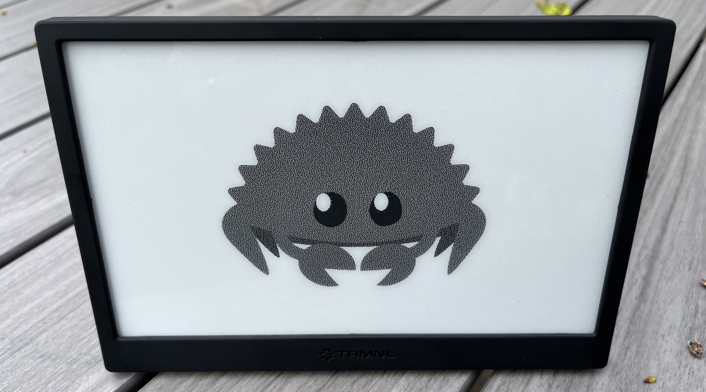

# TRMRS

Pronounced _Tremors_ 🪱

This is a small prototype [Rust](https://www.rust-lang.org/) firmware for the [TRMNL](https://usetrmnl.com/) device. It's nowhere near the capability of the [official firmware](https://github.com/usetrmnl/firmware).

It's based on [esp-rs/esp-idf-template](https://github.com/esp-rs/esp-idf-template).

For now you can press the button to alternate between displaying random noise and displaying an image, then it will go to sleep after a minute of inactivity.

<center></center>

## Building and Running

Build the project:

```bash
cargo build
```

Flash to the device:

```bash
espflash flash target/riscv32imc-esp-espidf/debug/trmrs
```

View serial output:

```bash
espflash monitor
```
