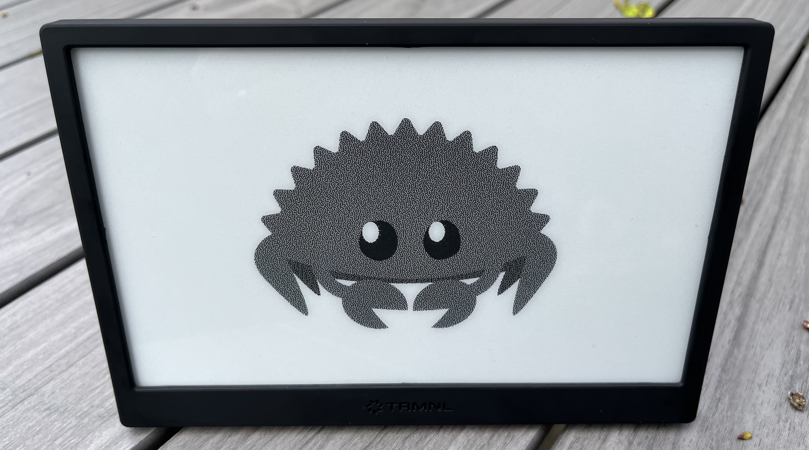

# TRMRS

Pronounced _Tremors_ 🪱

This is a small prototype [Rust](https://www.rust-lang.org/) firmware for the [TRMNL](https://usetrmnl.com/) device. It's nowhere near the capability of the [official firmware](https://github.com/usetrmnl/firmware).

It's based on [esp-rs/esp-idf-template](https://github.com/esp-rs/esp-idf-template).

For now you can press the button to alternate between displaying random noise and displaying an image, then it will go to sleep after a minute of inactivity.

<center></center>

## Toolchain

The device target, `riscv32imc-esp-espidf`, is a [Tier 3][tiers] Rust target. Tier 3 means
rustup ships no prebuilt `std` for it, so `std` has to be compiled from source via
`-Z build-std` (see `device/.cargo/config.toml`) — and that's a nightly-only feature. A
proposal to promote the RISC-V ESP-IDF targets to Tier 2 ([compiler-team#864][mcp]) was
closed as not planned, so nightly stays a requirement for now.

`rust-toolchain.toml` pins an exact nightly on purpose. Because `std` is rebuilt from
whatever the pinned nightly ships, changes to `std` itself can break this target with no
warning. To move the pin:

```bash
just get-latest-nightly-version
just set-nightly-version nightly-YYYY-MM-DD
cd device && cargo build   # confirm std still compiles for the target
```

[tiers]: https://doc.rust-lang.org/rustc/platform-support.html
[mcp]: https://github.com/rust-lang/compiler-team/issues/864

## Building and Running

Build the project:

```bash
cd device
cargo build
```

Flash to the device:

```bash
espflash flash ../target/riscv32imc-esp-espidf/debug/trmrs-device
```

View serial output:

```bash
espflash monitor
```

Run CLI

```bash
cargo run -p cli
```

Run Tests

```bash
cargo test -p trmrs_core
```
